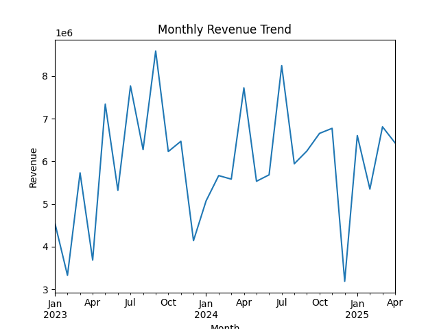

# Car Sales Analysis Project

## Overview
This project analyzes car sales data using Python.  
The goal of the project is to explore sales trends, calculate revenue, and visualize business insights using data analysis techniques.

---

## Features

- Data cleaning and preprocessing
- Monthly revenue analysis
- Sales trend visualization
- CSV data handling
- Revenue graph generation
- Business insights from sales data

---

## Technologies Used

- Python
- Pandas
- NumPy
- Matplotlib
- PgAdmin

---

## Project Structure

```bash
car-sales-project/
│
├── data/
│   └── car_sales.csv
│
├── images/
│   └── Monthly_Revenue_Graph.png
│
├── src/
│   └── car_analysis.py
│
├── README.md
├── requirements.txt
├── .gitignore
└── LICENSE
```

---

## Dataset

The dataset contains car sales information including:
- Car brand
- Model
- Sales amount
- Revenue
- Monthly sales performance

---

## Installation

Clone the repository:

```bash
git clone https://github.com/YOUR_USERNAME/car-sales-analysis-python.git
```

Move into the project folder:

```bash
cd car-sales-analysis-python
```

Install required libraries:

```bash
pip install -r requirements.txt
```

---

## How to Run

Run the Python script:

```bash
python src/car_analysis.py
```

---

## Output

The project generates:
- Revenue analysis
- Sales summaries
- Monthly revenue graph

### Sample Visualization



---

## Key Insights

- Identifies high-performing sales months
- Tracks revenue trends
- Helps understand sales distribution
- Provides business analytics using Python

---

## Future Improvements

- Add machine learning prediction
- Build interactive dashboard using Streamlit
- Add Power BI integration
- Deploy as a web application

---

## Author

Anmol

---

## License

This project is licensed under the MIT License.
